# LMCS Insight — Modular decomposition

This report explains how the codebase is split into modules and how dependencies flow. Narrative detail lives here in **Mermaid** form; the same diagrams are also extracted as separate files under [`docs/modular-decomposition/`](./modular-decomposition/README.md) for reuse or side-by-side viewing. For prose-only API listings, see [IMPLEMENTATION_PLAN.md](./IMPLEMENTATION_PLAN.md) and [api-endpoint-guide.md](./api-endpoint-guide.md).

---

## 1. Purpose, scope, and vocabulary

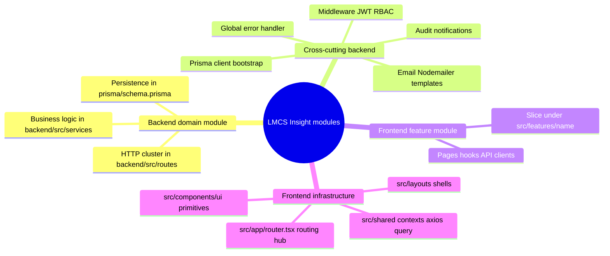

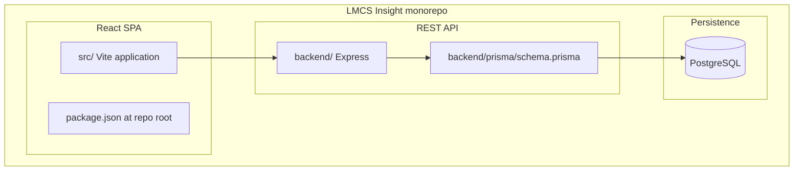

---

## 2. System architecture

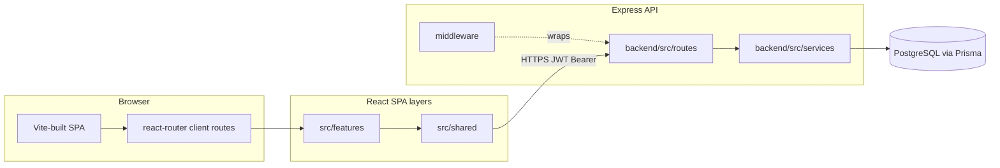

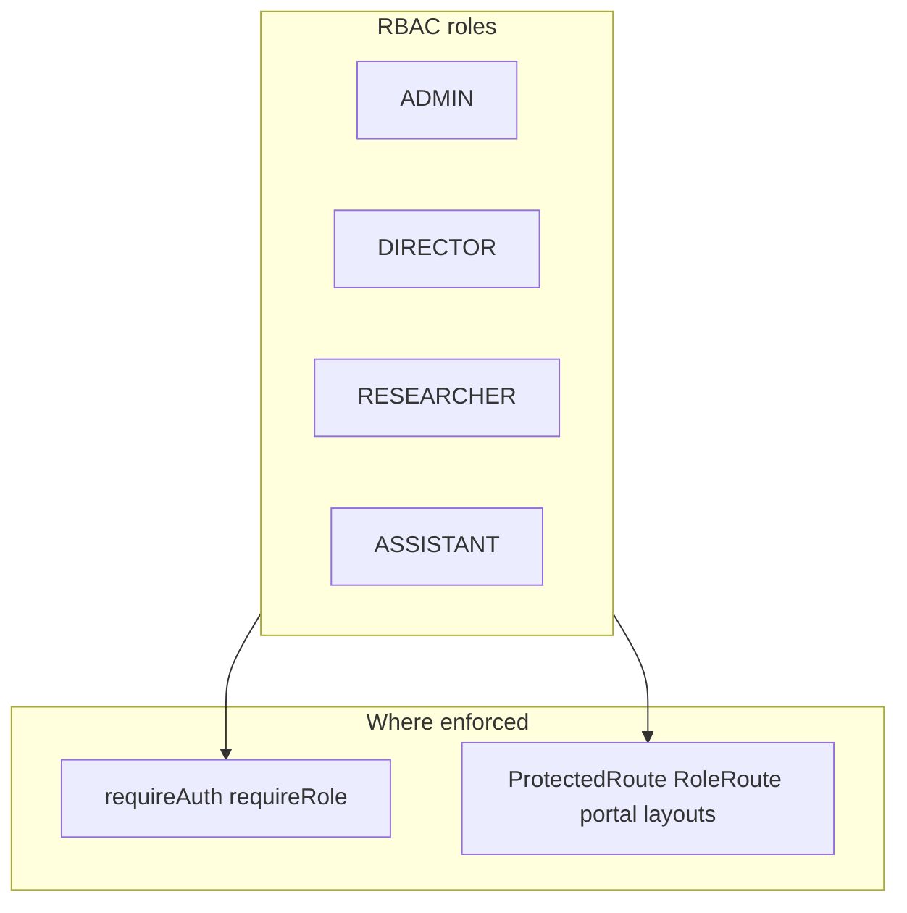

**Runtime boundaries:** one backend process ([`backend/src/server.ts`](../backend/src/server.ts) → [`backend/src/app.ts`](../backend/src/app.ts)); one static SPA bundle with client-side routing ([`src/app/router.tsx`](../src/app/router.tsx)).

---

## 3. Backend modular decomposition

### 3.1 Bootstrap and route registration

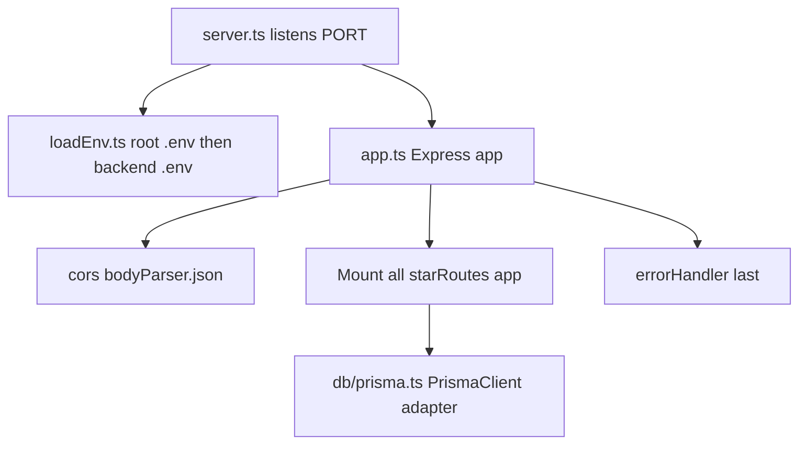

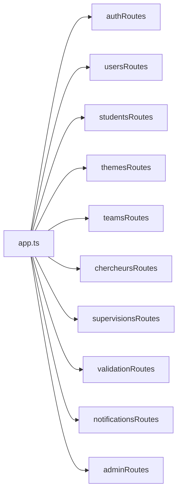

`routes/index.ts` is a placeholder and is **not** mounted by `app.ts`.

### 3.2 Domain modules — routes, services, access

```mermaid
flowchart TB
  subgraph auth [Auth]
    ar[routes/auth.ts]
    as[services/auth.ts]
    ar --> as
    ar -.->|public| login[POST login refresh]
    ar -.->|JWT| me[GET me]
  end

  subgraph users [Users admin]
    ur[routes/users.ts]
    us[services/users.ts]
    ur --> us
    ur -.->|ADMIN only| ucrud[CRUD stats reset-password]
  end

  subgraph students [Students]
    sr[routes/students.ts]
    ss[services/students.ts]
    sr --> ss
    sr -.->|authenticated| scrud[CRUD list]
  end

  subgraph themes [Themes]
    tr[routes/themes.ts]
    ts[services/themes.ts]
    tr --> ts
    tr -.->|read auth| tlist[list get]
    tr -.->|write ASSISTANT ADMIN| twrite[create update delete]
  end

  subgraph teams [Teams]
    ter[routes/teams.ts]
    tes[services/teams.ts]
    ter --> tes
    ter -.->|read auth| telist[list get]
    ter -.->|write ADMIN| tecrud[create update delete]
  end

  subgraph chercheurs [Chercheurs directory]
    chr[routes/chercheurs.ts]
    chs[services/chercheurs.ts]
    chr --> chs
    chr -.->|authenticated| chlist[GET list]
  end

  subgraph supervisions [Supervisions]
    sur[routes/supervisions.ts]
    sus[services/supervisions.ts]
    val[services/validation.ts]
    sur --> sus
    sur --> val
    sur -.->|ASSISTANT| scud[create update delete supervisors]
    sur -.->|RESEARCHER| sval[validate reject revise]
    sur -.->|scoped lists| slist[GET list detail]
  end

  subgraph validationViews [Validation aggregated reads]
    vr[routes/validation.ts]
    vs[services/validation.ts]
    vr --> vs
    vr -.->|ASSISTANT DIRECTOR RESEARCHER| vqueue[queue stats history]
  end

  subgraph notifications [Notifications]
    nr[routes/notifications.ts]
    ns[services/notifications.ts]
    nr --> ns
    nr -.->|authenticated| nlist[GET list mark read]
  end

  subgraph admin [Admin dashboard and audit API]
    adr[routes/admin.ts]
    ads[services/admin.ts]
    adr --> ads
    adr -.->|ADMIN| astats[stats audit-logs]
  end
```

### 3.3 Cross-cutting backend modules

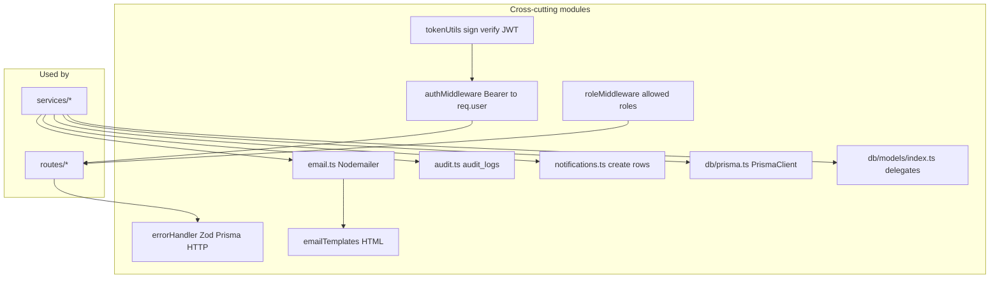

### 3.4 Persistence — Prisma bounded context

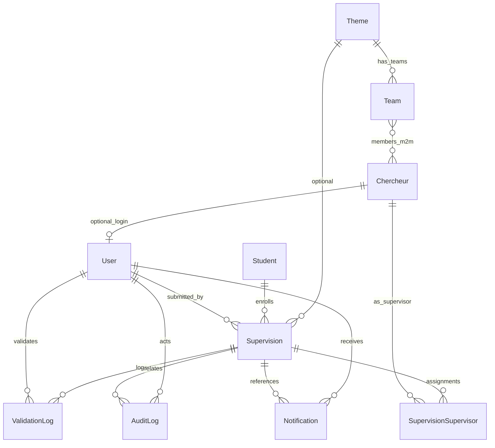

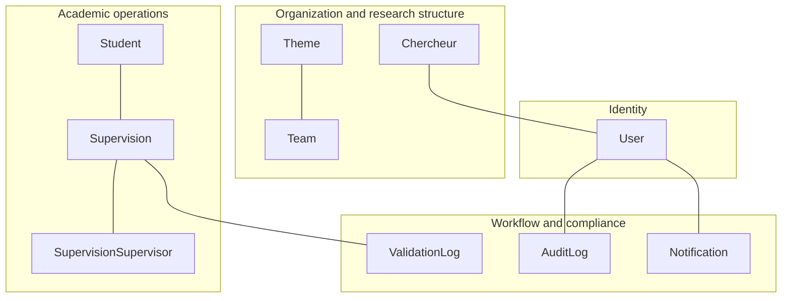

### 3.5 Operations and quality (non-runtime API surface)

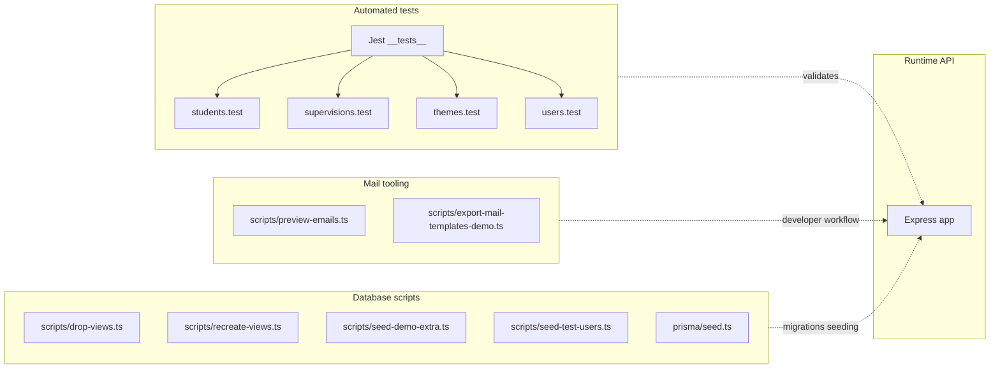

---

## 4. Frontend modular decomposition

Path helpers: [`src/config/routes.ts`](../src/config/routes.ts). Router: [`src/app/router.tsx`](../src/app/router.tsx).

### 4.1 Feature folders and portals

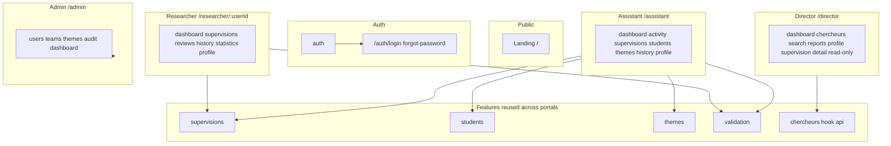

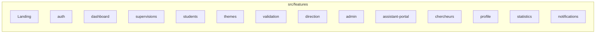

### 4.2 Frontend infrastructure

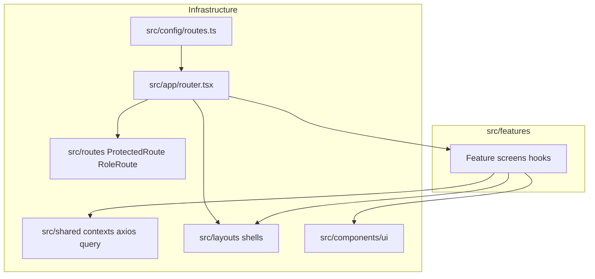

### 4.3 Frontend dependency direction

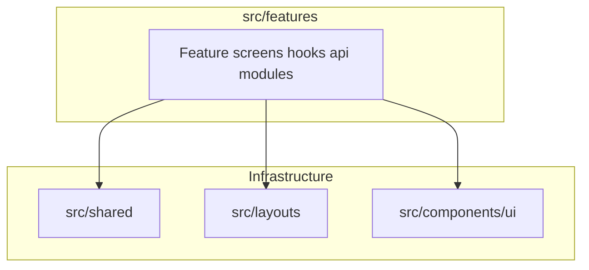

Prefer explicit APIs between features (for example `chercheurs` hooks consumed by `direction` and `admin`) instead of importing another feature’s internals.

---

## 5. Cross-cutting concerns — end to end

```mermaid
flowchart TB
  subgraph authN [Authentication]
    b1[JWT Authorization header]
    b2[/api/v1/auth]
    f1[login stores tokens]
    f2[axios Bearer AuthContext]
  end

  subgraph rbac [RBAC]
    br[requireAuth requireRole]
    fr[RoleRoute portal routes]
  end

  subgraph valWF [Supervision validation]
    bv[validationStatus ValidationLog validate reject revise]
    fv[validation UI queue detail history]
  end

  subgraph emailN [Email]
    be[Nodemailer templates]
    fe[Forgot password flows via API]
  end

  subgraph auditN [Audit]
    ba[audit_logs admin API]
    fa[Admin audit page]
  end

  subgraph notifN [Notifications]
    bn[notifications REST]
    fn[hooks shell UI]
  end

  b1 --> br
  bv --> fv
  ba --> fa
  bn --> fn
```

---

## 6. Layered dependency summary

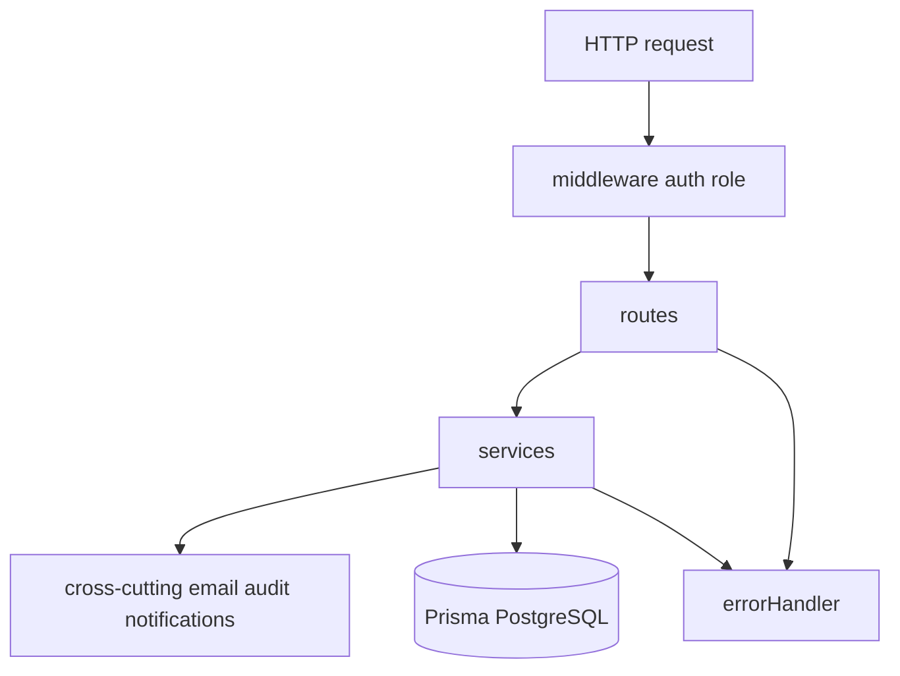

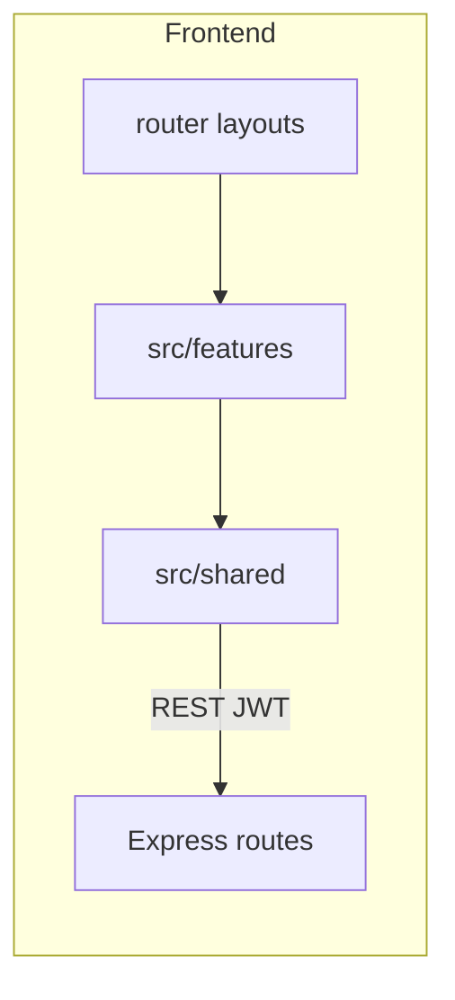

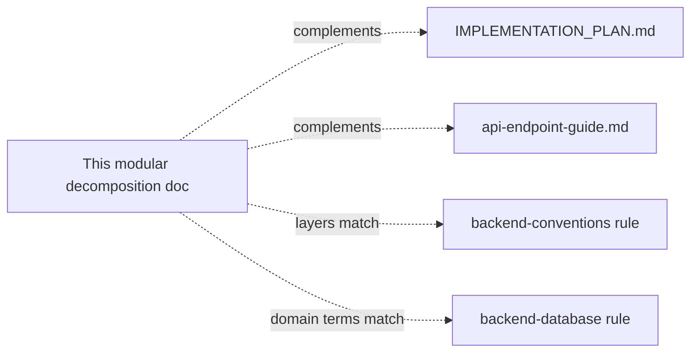

---

*Diagram sources: [`docs/modular-decomposition/`](./modular-decomposition/README.md).*
