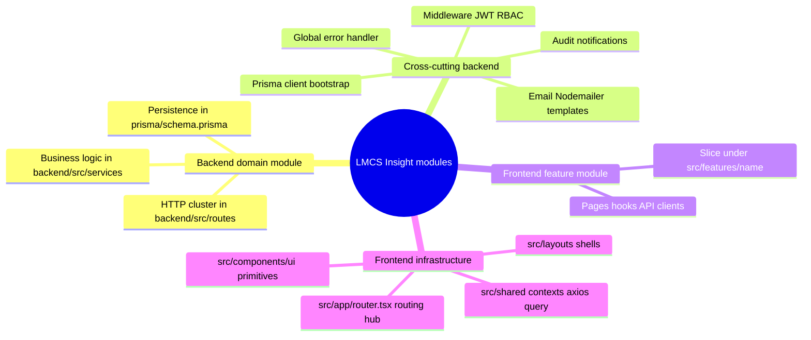

# Module definitions (documentation vocabulary)

```mermaid
mindmap
  root((LMCS Insight modules))
    Backend domain module
      HTTP cluster in backend/src/routes
      Business logic in backend/src/services
      Persistence in prisma/schema.prisma
    Cross-cutting backend
      Middleware JWT RBAC
      Email Nodemailer templates
      Audit notifications
      Global error handler
      Prisma client bootstrap
    Frontend feature module
      Slice under src/features/name
      Pages hooks API clients
    Frontend infrastructure
      src/shared contexts axios query
      src/layouts shells
      src/components/ui primitives
      src/app/router.tsx routing hub
```
