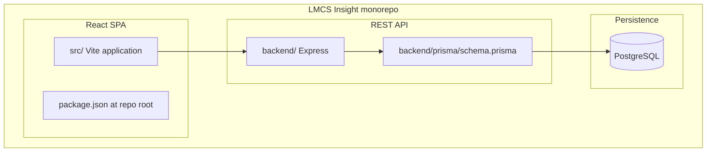

# Repository layout covered by modular decomposition

```mermaid
flowchart TB
  subgraph mono [LMCS Insight monorepo]
    subgraph spa [React SPA]
      rootPkg[package.json at repo root]
      src[src/ Vite application]
    end
    subgraph api [REST API]
      backend[backend/ Express]
      prismaSchema[backend/prisma/schema.prisma]
    end
    subgraph db [Persistence]
      pg[(PostgreSQL)]
    end
  end
  src --> backend
  backend --> prismaSchema
  prismaSchema --> pg
```
