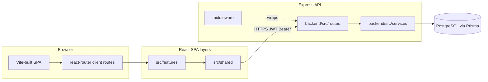
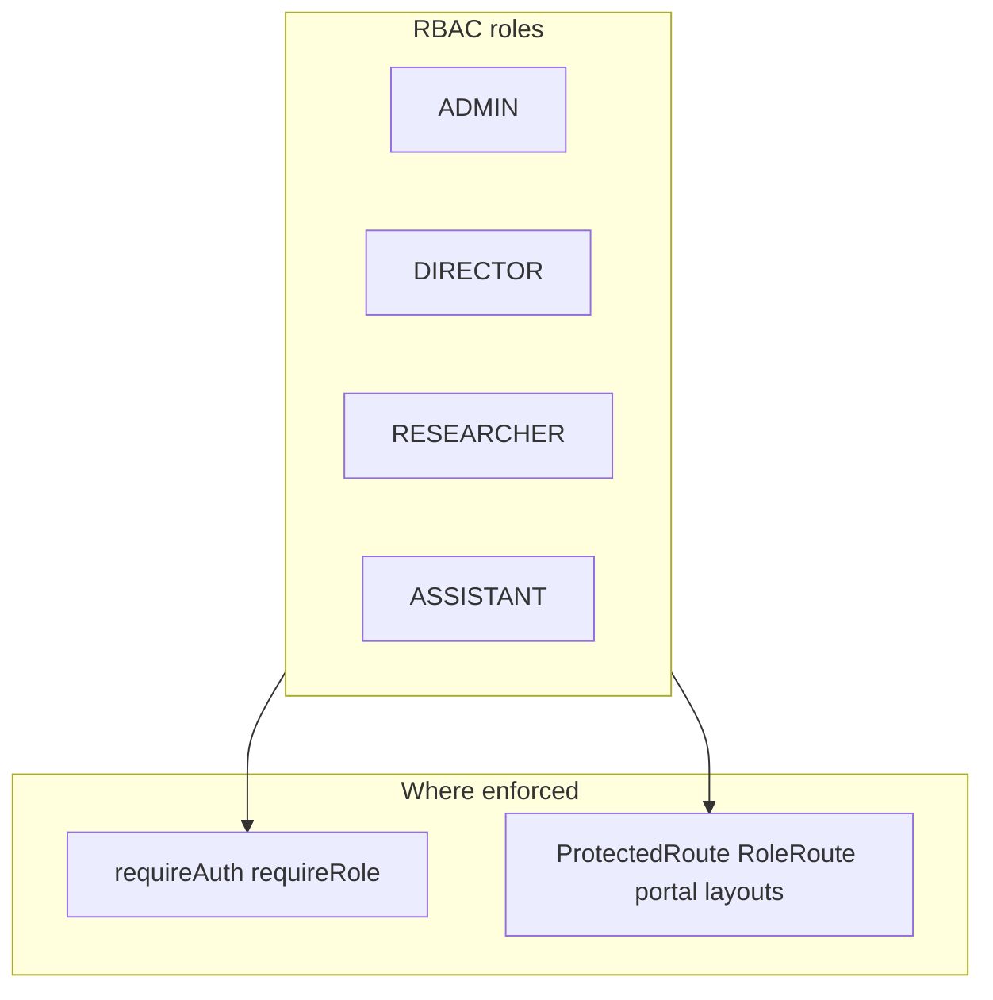

# System architecture — runtime view

```mermaid
flowchart LR
  subgraph client [Browser]
    Vite[Vite-built SPA]
    Router[react-router client routes]
    Vite --> Router
  end
  subgraph spa [React SPA layers]
    Features[src/features]
    Shared[src/shared]
    Features --> Shared
  end
  subgraph api [Express API]
    Routes[backend/src/routes]
    Services[backend/src/services]
    MW[middleware]
    Routes --> Services
    MW -. wraps .-> Routes
  end
  DB[(PostgreSQL via Prisma)]
  Router --> Features
  Shared -->|HTTPS JWT Bearer| Routes
  Services --> DB
```

```mermaid
flowchart TB
  subgraph roles [RBAC roles]
    ADMIN[ADMIN]
    DIRECTOR[DIRECTOR]
    RESEARCHER[RESEARCHER]
    ASSISTANT[ASSISTANT]
  end
  subgraph enforcement [Where enforced]
    Server[requireAuth requireRole]
    UI[ProtectedRoute RoleRoute portal layouts]
  end
  roles --> Server
  roles --> UI
```
