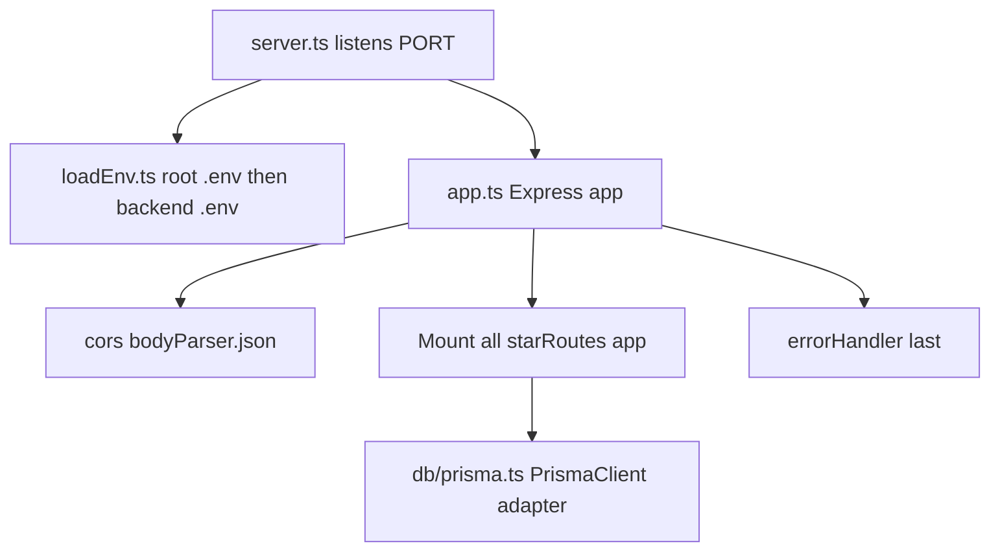
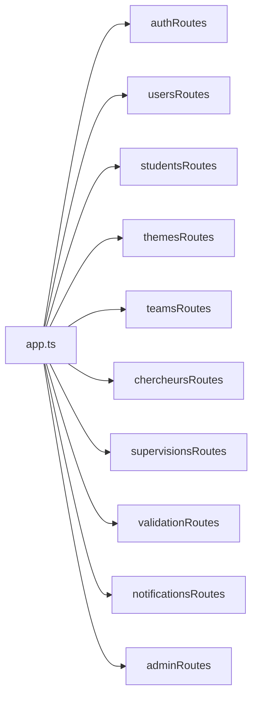

# Backend bootstrap and composition root

```mermaid
flowchart TB
  server[server.ts listens PORT]
  loadEnv[loadEnv.ts root .env then backend .env]
  app[app.ts Express app]
  cors[cors bodyParser.json]
  routes[Mount all starRoutes app]
  err[errorHandler last]
  prismaInit[db/prisma.ts PrismaClient adapter]
  server --> loadEnv
  server --> app
  app --> cors
  app --> routes
  app --> err
  routes --> prismaInit
```

```mermaid
flowchart LR
  appTs[app.ts]
  authR[authRoutes]
  usersR[usersRoutes]
  studentsR[studentsRoutes]
  themesR[themesRoutes]
  teamsR[teamsRoutes]
  chercheursR[chercheursRoutes]
  supervisionsR[supervisionsRoutes]
  validationR[validationRoutes]
  notificationsR[notificationsRoutes]
  adminR[adminRoutes]
  appTs --> authR
  appTs --> usersR
  appTs --> studentsR
  appTs --> themesR
  appTs --> teamsR
  appTs --> chercheursR
  appTs --> supervisionsR
  appTs --> validationR
  appTs --> notificationsR
  appTs --> adminR
```

> Note: `routes/index.ts` is a placeholder and is not mounted by `app.ts`.
