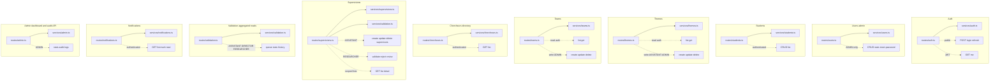

# Backend domain modules — routes, services, access

```mermaid
flowchart TB
  subgraph auth [Auth]
    ar[routes/auth.ts]
    as[services/auth.ts]
    ar --> as
    ar -.->|public| login[POST login refresh]
    ar -.->|JWT| me[GET me]
  end

  subgraph users [Users admin]
    ur[routes/users.ts]
    us[services/users.ts]
    ur --> us
    ur -.->|ADMIN only| ucrud[CRUD stats reset-password]
  end

  subgraph students [Students]
    sr[routes/students.ts]
    ss[services/students.ts]
    sr --> ss
    sr -.->|authenticated| scrud[CRUD list]
  end

  subgraph themes [Themes]
    tr[routes/themes.ts]
    ts[services/themes.ts]
    tr --> ts
    tr -.->|read auth| tlist[list get]
    tr -.->|write ASSISTANT ADMIN| twrite[create update delete]
  end

  subgraph teams [Teams]
    ter[routes/teams.ts]
    tes[services/teams.ts]
    ter --> tes
    ter -.->|read auth| telist[list get]
    ter -.->|write ADMIN| tecrud[create update delete]
  end

  subgraph chercheurs [Chercheurs directory]
    chr[routes/chercheurs.ts]
    chs[services/chercheurs.ts]
    chr --> chs
    chr -.->|authenticated| chlist[GET list]
  end

  subgraph supervisions [Supervisions]
    sur[routes/supervisions.ts]
    sus[services/supervisions.ts]
    val[services/validation.ts]
    sur --> sus
    sur --> val
    sur -.->|ASSISTANT| scud[create update delete supervisors]
    sur -.->|RESEARCHER| sval[validate reject revise]
    sur -.->|scoped lists| slist[GET list detail]
  end

  subgraph validationViews [Validation aggregated reads]
    vr[routes/validation.ts]
    vs[services/validation.ts]
    vr --> vs
    vr -.->|ASSISTANT DIRECTOR RESEARCHER| vqueue[queue stats history]
  end

  subgraph notifications [Notifications]
    nr[routes/notifications.ts]
    ns[services/notifications.ts]
    nr --> ns
    nr -.->|authenticated| nlist[GET list mark read]
  end

  subgraph admin [Admin dashboard and audit API]
    adr[routes/admin.ts]
    ads[services/admin.ts]
    adr --> ads
    adr -.->|ADMIN| astats[stats audit-logs]
  end
```
