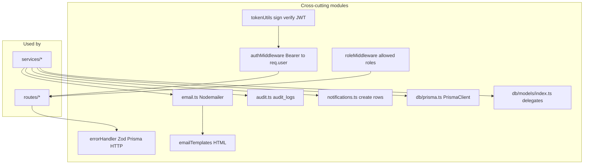

# Backend cross-cutting concerns

```mermaid
flowchart TB
  subgraph cross [Cross-cutting modules]
    jwt[tokenUtils sign verify JWT]
    amw[authMiddleware Bearer to req.user]
    rmw[roleMiddleware allowed roles]
    eh[errorHandler Zod Prisma HTTP]
    email[email.ts Nodemailer]
    tmpl[emailTemplates HTML]
    audit[audit.ts audit_logs]
    notifyW[notifications.ts create rows]
    prisma[db/prisma.ts PrismaClient]
    models[db/models/index.ts delegates]
  end

  subgraph consumers [Used by]
    routes[routes/*]
    services[services/*]
  end

  jwt --> amw
  amw --> routes
  rmw --> routes
  routes --> eh
  services --> prisma
  services --> models
  services --> email
  services --> audit
  services --> notifyW
  email --> tmpl
```
