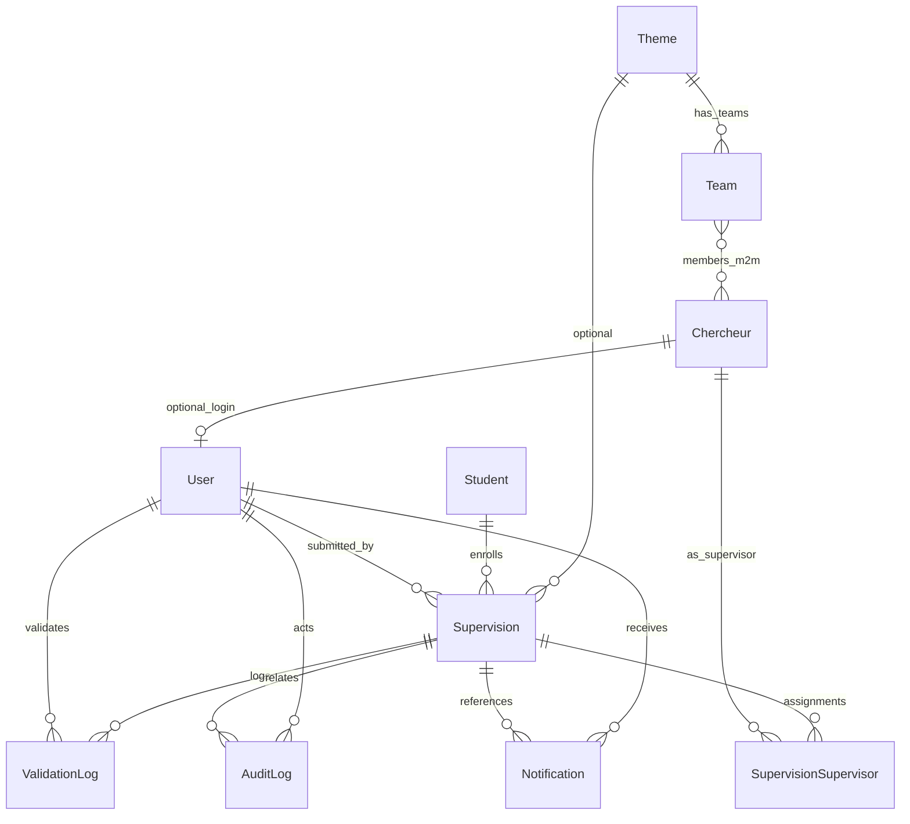
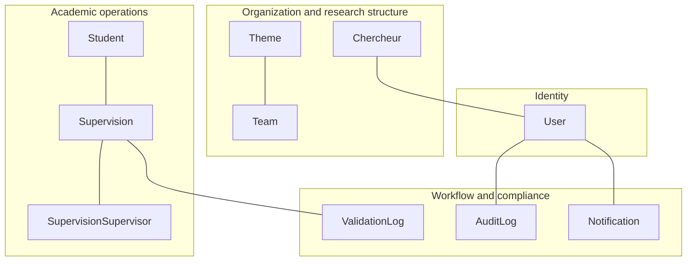

# Prisma domain model — bounded context

```mermaid
erDiagram
  Theme ||--o{ Team : has_teams
  Theme ||--o{ Supervision : optional
  Team }o--o{ Chercheur : members_m2m
  Chercheur ||--o| User : optional_login
  Student ||--o{ Supervision : enrolls
  Supervision ||--o{ SupervisionSupervisor : assignments
  Chercheur ||--o{ SupervisionSupervisor : as_supervisor
  User ||--o{ Supervision : submitted_by
  Supervision ||--o{ ValidationLog : logs
  User ||--o{ ValidationLog : validates
  User ||--o{ AuditLog : acts
  Supervision ||--o{ AuditLog : relates
  User ||--o{ Notification : receives
  Supervision ||--o{ Notification : references
```

```mermaid
flowchart TB
  subgraph org [Organization and research structure]
    Theme
    Team
    Chercheur
  end

  subgraph identity [Identity]
    User
  end

  subgraph academic [Academic operations]
    Student
    Supervision
    SupervisionSupervisor
  end

  subgraph workflow [Workflow and compliance]
    ValidationLog
    AuditLog
    Notification
  end

  Theme --- Team
  Chercheur --- User
  Student --- Supervision
  Supervision --- SupervisionSupervisor
  Supervision --- ValidationLog
  User --- AuditLog
  User --- Notification
```
