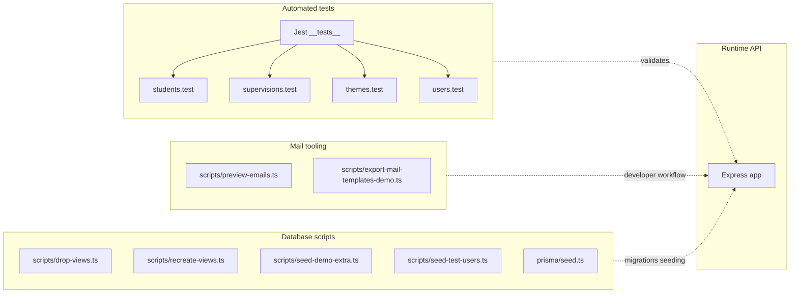

# Operations and quality — outside the live API surface

```mermaid
flowchart LR
  subgraph tests [Automated tests]
    jest[Jest __tests__]
    studentsT[students.test]
    superT[supervisions.test]
    themesT[themes.test]
    usersT[users.test]
    jest --> studentsT
    jest --> superT
    jest --> themesT
    jest --> usersT
  end

  subgraph mailscripts [Mail tooling]
    preview[scripts/preview-emails.ts]
    exportT[scripts/export-mail-templates-demo.ts]
  end

  subgraph dbscripts [Database scripts]
    dropV[scripts/drop-views.ts]
    recV[scripts/recreate-views.ts]
    seedE[scripts/seed-demo-extra.ts]
    seedU[scripts/seed-test-users.ts]
    seedP[prisma/seed.ts]
  end

  subgraph runtime [Runtime API]
    api[Express app]
  end

  tests -.->|validates| api
  mailscripts -.->|developer workflow| api
  dbscripts -.->|migrations seeding| api
```
