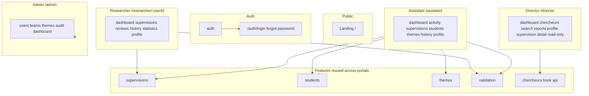
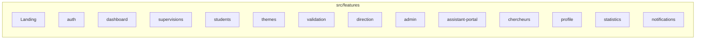

# Frontend feature modules — responsibilities and portals

```mermaid
flowchart TB
  subgraph public [Public]
    Landing[Landing /]
  end

  subgraph authBlock [Auth]
    AuthF[auth]
    AuthF --> pathsAuth["/auth/login forgot-password"]
  end

  subgraph researcher [Researcher /researcher/:userId]
    dashR[dashboard supervisions reviews history statistics profile]
  end

  subgraph director [Director /director]
    dashD[dashboard chercheurs search reports profile supervision detail read-only]
  end

  subgraph assistant [Assistant /assistant]
    dashA[dashboard activity supervisions students themes history profile]
  end

  subgraph adminP [Admin /admin]
    adm[users teams themes audit dashboard]
  end

  subgraph reuse [Features reused across portals]
    SupFeat[supervisions]
    StuFeat[students]
    ThFeat[themes]
    ValFeat[validation]
    ChrFeat[chercheurs hook api]
  end

  researcher --> SupFeat
  researcher --> ValFeat
  director --> ChrFeat
  assistant --> SupFeat
  assistant --> StuFeat
  assistant --> ThFeat
  assistant --> ValFeat
  adminP --> adm
```

```mermaid
flowchart LR
  subgraph features [src/features]
    f1[Landing]
    f2[auth]
    f3[dashboard]
    f4[supervisions]
    f5[students]
    f6[themes]
    f7[validation]
    f8[direction]
    f9[admin]
    f10[assistant-portal]
    f11[chercheurs]
    f12[profile]
    f13[statistics]
    f14[notifications]
  end
```
