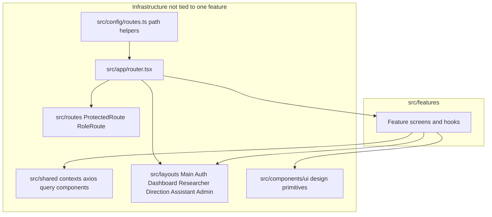
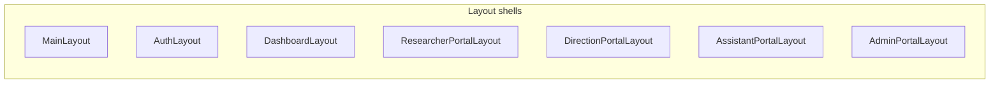

# Frontend infrastructure layers

```mermaid
flowchart TB
  subgraph infra [Infrastructure not tied to one feature]
    shared[src/shared contexts axios query components]
    guards[src/routes ProtectedRoute RoleRoute]
    layouts[src/layouts Main Auth Dashboard Researcher Direction Assistant Admin]
    ui[src/components/ui design primitives]
    router[src/app/router.tsx]
    routesCfg[src/config/routes.ts path helpers]
  end

  subgraph features [src/features]
    screens[Feature screens and hooks]
  end

  router --> layouts
  router --> guards
  router --> screens
  routesCfg --> router
  screens --> shared
  screens --> layouts
  screens --> ui
```

```mermaid
flowchart LR
  subgraph layoutsList [Layout shells]
    L1[MainLayout]
    L2[AuthLayout]
    L3[DashboardLayout]
    L4[ResearcherPortalLayout]
    L5[DirectionPortalLayout]
    L6[AssistantPortalLayout]
    L7[AdminPortalLayout]
  end
```
