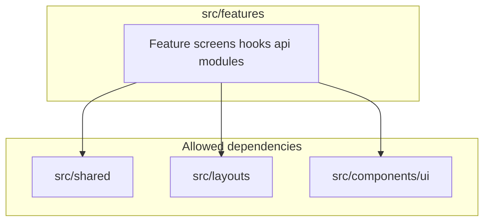
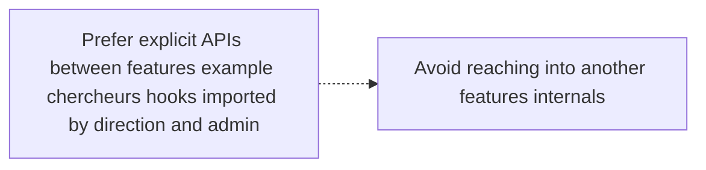

# Frontend dependency direction

```mermaid
flowchart TB
  subgraph features [src/features]
    F[Feature screens hooks api modules]
  end

  subgraph infra [Allowed dependencies]
    Shared[src/shared]
    Layouts[src/layouts]
    UI[src/components/ui]
  end

  F --> Shared
  F --> Layouts
  F --> UI
```

```mermaid
flowchart LR
  directionLR[Prefer explicit APIs between features example chercheurs hooks imported by direction and admin]
  avoid[Avoid reaching into another features internals]
  directionLR -.-> avoid
```
