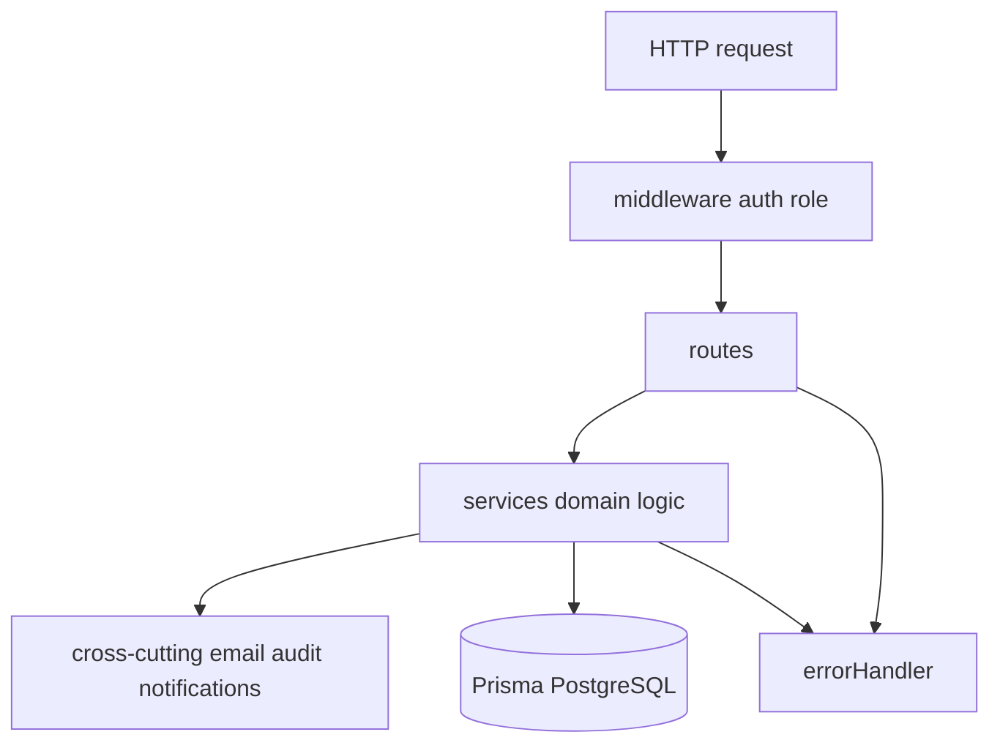
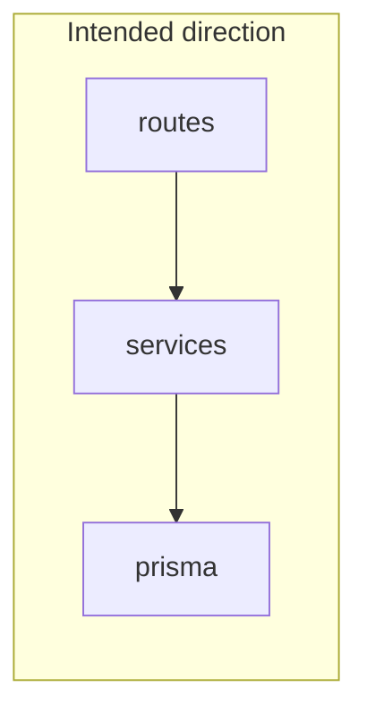

# Backend layered dependency flow

```mermaid
flowchart TB
  HTTP[HTTP request]
  R[routes]
  M[middleware auth role]
  S[services domain logic]
  X[cross-cutting email audit notifications]
  P[(Prisma PostgreSQL)]
  E[errorHandler]

  HTTP --> M
  M --> R
  R --> S
  S --> X
  S --> P
  R --> E
  S --> E
```

```mermaid
flowchart LR
  subgraph allowed [Intended direction]
    routesLayer[routes]
    servicesLayer[services]
    prismaLayer[prisma]
    routesLayer --> servicesLayer --> prismaLayer
  end
```
