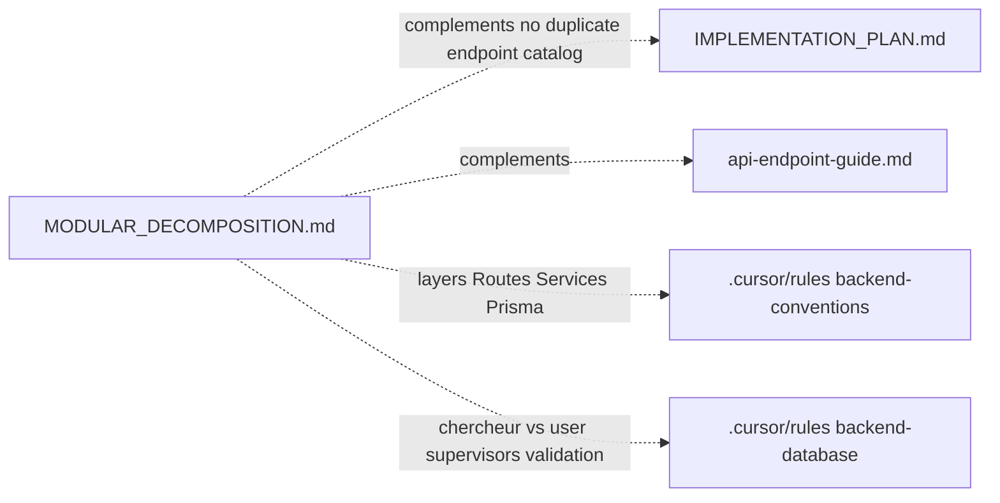

# Alignment with other documentation and rules

```mermaid
flowchart LR
  thisDoc[MODULAR_DECOMPOSITION.md]
  impl[IMPLEMENTATION_PLAN.md]
  api[api-endpoint-guide.md]
  rulesConv[.cursor/rules backend-conventions]
  rulesDb[.cursor/rules backend-database]

  thisDoc -.->|complements no duplicate endpoint catalog| impl
  thisDoc -.->|complements| api
  thisDoc -.->|layers Routes Services Prisma| rulesConv
  thisDoc -.->|chercheur vs user supervisors validation| rulesDb
```
